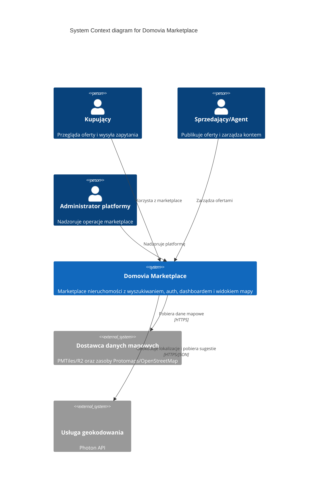
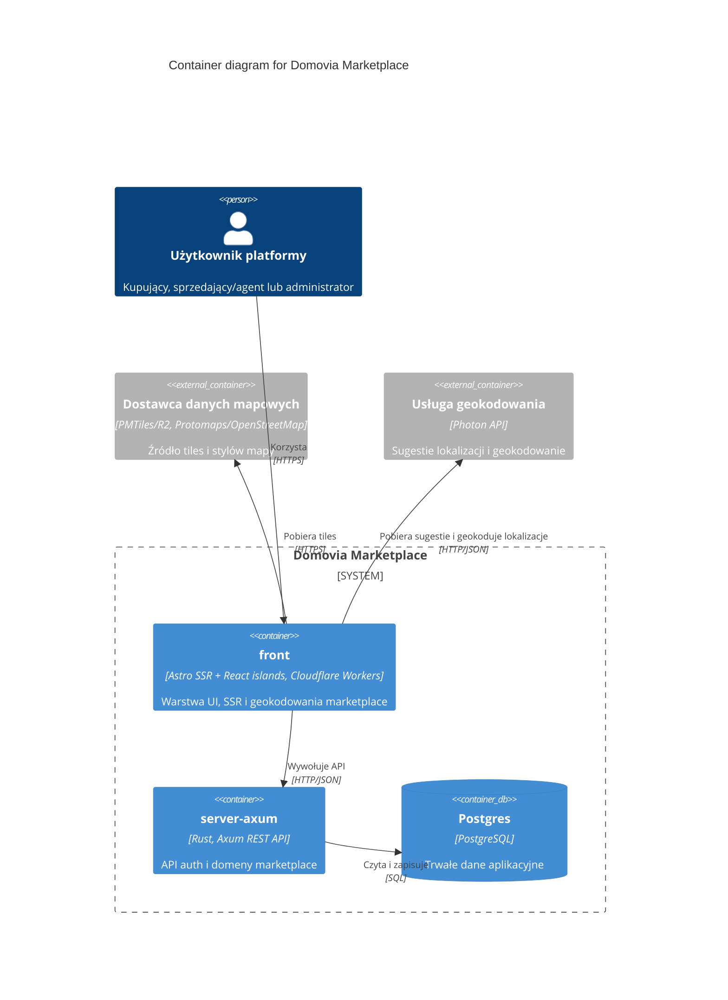

# Diagram C4

Diagramy poniżej opisują runtime architekturę całego systemu marketplace. Skupiają się na rzeczywistych elementach uruchamianych dla aplikacji, a nie na narzędziach developerskich w monorepo.

## C1 — Kontekst systemu

Diagram C1 zachowuje rozróżnienie ról biznesowych, bo to one definiują kontekst systemu.

## C2 — Kontenery

W C2 role użytkowników są celowo zagregowane do jednego aktora, bo wszystkie wchodzą do systemu przez ten sam kontener `front`.

Najważniejsze odpowiedzialności kontenerów:

- `front`: strony publiczne, logowanie/rejestracja, dashboard, widok mapy ofert, endpoint `/api/geocode`, autocomplete lokalizacji oraz SSR-owe geokodowanie wejścia dla `/listing`.
- `server-axum`: endpointy `/auth/*` i `/api/v1/*`; moduły `auth`, `accounts`, `geo`, `properties`, `listings`, `engagement`.
- `Postgres`: użytkownicy, sesje `auth_session`, nieruchomości, listingi, wishlisty i wiadomości.

## Poza zakresem

- `Turborepo`, GitHub Actions i `compose.yaml` z Autobase są narzędziami developerskimi i nie są częścią runtime architektury systemu.
- Lokalny kontener Photon uruchamiany przez `compose.yaml` jest tylko developerskim provisioningiem zależności geokodowania; diagram modeluje samą usługę geokodowania jako dependency runtime `front`.
- Diagram nie modeluje osobnego BFF, Redis, kolejek ani dodatkowej bazy danych, bo takich elementów nie ma w aktualnym kodzie.
